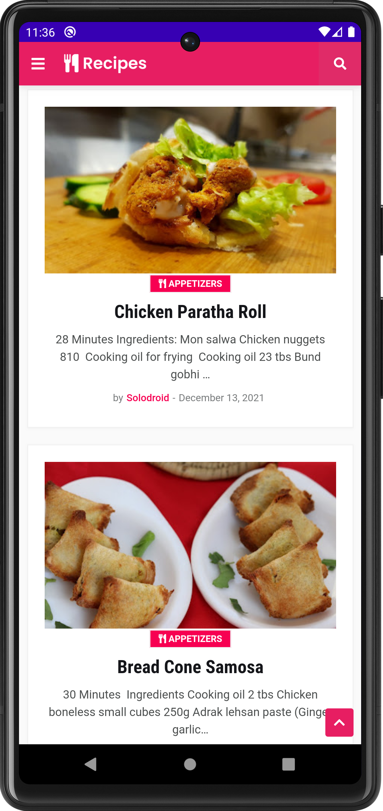
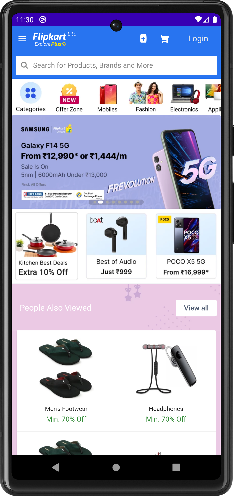
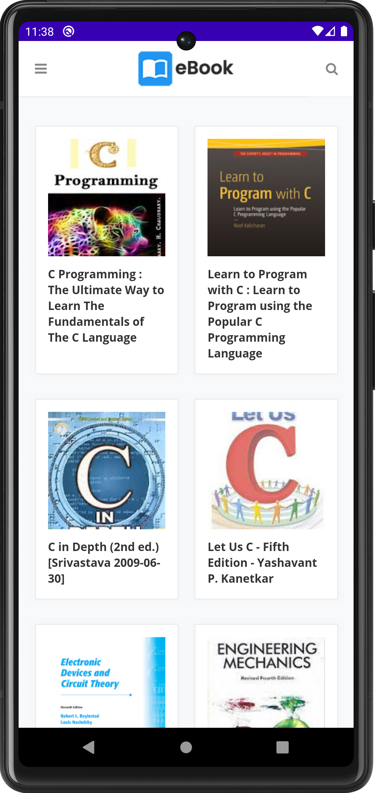
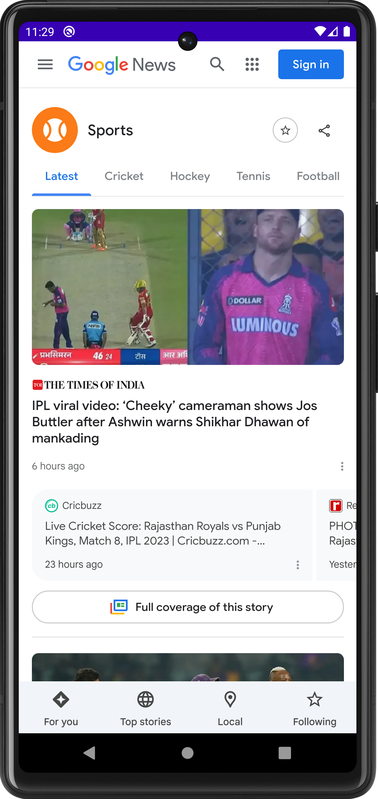
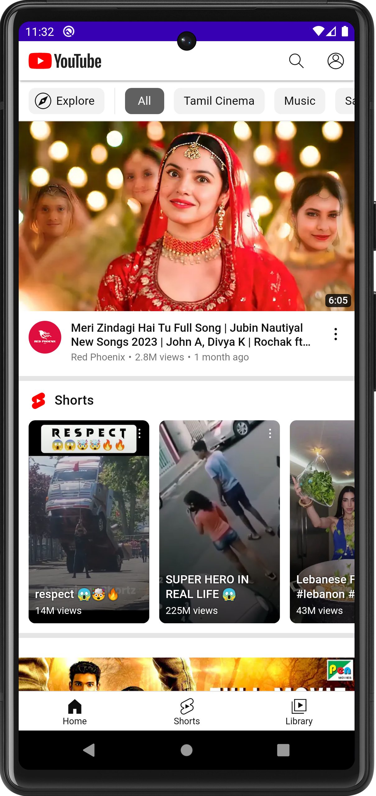

# WebView-Android-App

# Instructions 

This is a simple Android app that displays a website using a WebView component. The app fetches the website content from a URL and renders it inside the WebView, providing users with a native-like browsing experience.

<h3>Features</h3>
<ul>
    <li>Uses a WebView component to render website content.</li>
    <li>No internet detection.</li>
    <li>Displays a progress bar while the website is loading.</li>
    <li>Handles common web navigation actions (e.g., back/forward, refresh).</li>
    <li>Supports customizing the website URL and the app title and logo.</li>
</ul>
<h3>Requirements</h3>
<ul>
    <li>Android SDK 21+</li>
    <li>Java 8+</li>
    <li>Gradle 4.1+</li>
</ul>
<h3>Installation</h3>
<ol>
    <li>Clone the repository.</li>
    <li>Open the project in Android Studio.</li>
    <li>Change the URL and add your Website or blog URL.</li>
    <li>Build and run the app on an Android device or emulator.</li>
</ol>
<h3>Usage</h3>
<ol>
    <li>Open the app on your Android device or emulator.</li>
    <li>In the app settings, enter the URL of the website you want to display and the title of the app.</li>
    <li>Click &quot;Save&quot; to apply the changes.</li>
    <li>The app will now load the website content and display it in a WebView.</li>
</ol>
<h3>Demo App</h3>

  

<h3>Screenshots</h3>
<table style="width:100%">
  <tr>
    <th>Example 1</th>
    <th>Example 2</th>
    <th>Example 3</th>
  </tr>
  <tr>
    <td></td>
    <td></td>
    <td></td>
  </tr>
  <tr>
    <th>Example 4</th>
    <th>Example 5</th>
    <th>Example 6</th>
  </tr>
  <tr>
    <td></td>
    <td></td>
    <td></td>
  </tr>
 
</table>
 
<h3>Contributing</h3>

Contributions are welcome! To contribute, fork the repository and submit a pull request.

<h3>Credits</h3>

This app was created by <a href="https://github.com/SibanandaKuanr">Sibananda Kuanr</a>. ❤️

